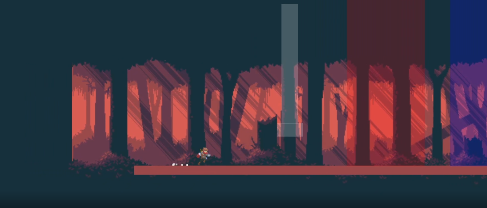
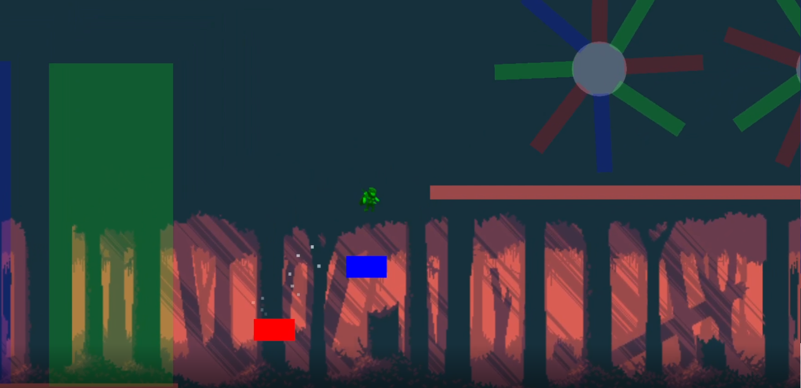

# Colored-Hero

---

### Table of Contents

- [Description](#description)
- [How To Play](#how-to-Play)
- [Learned](#learned)
- [Author Info](#author-info)

---

## Description
Color based game where Player has to change colors between red, green and blue to avoid deadly obstacles and use terrain to his advantage.

---

## How To Play
> Press "Space" to Jump | Press "A" to go left | Press "D" to go right 

> Press "J" to turn RED | Press "K" to turn GREEN | Press "L" to turn BLUE 

> Press "F" to blink to whichever direction you're facing

---

## Learned 
- Animator
- Animation
- Usage of Tags/Layers in Code
- Player movement
    * Custom number of jumps
    - Running
    - Blink
    - More advanced jump
- Simple usage of Photoshop
- Played with implementing 2 Players 
- Simple useage of Particle System

---

## Author Info

- Twitter - [@MarceliKumiers1](https://twitter.com/MarceliKumiers1)
- LinkedIn - [Marceli Kuśmierski](https://www.linkedin.com/in/marceli-ku%C5%9Bmierski-321969165/)

[Back To The Top](#Colored-Hero)
